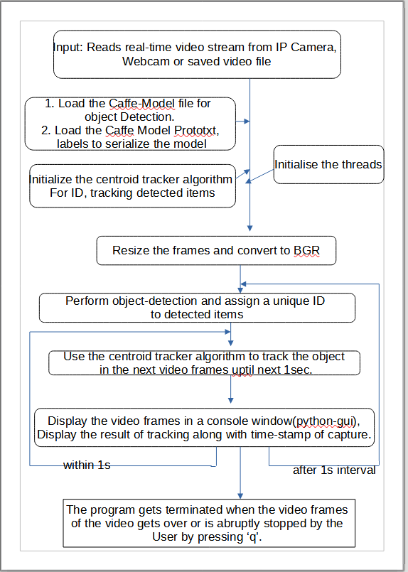
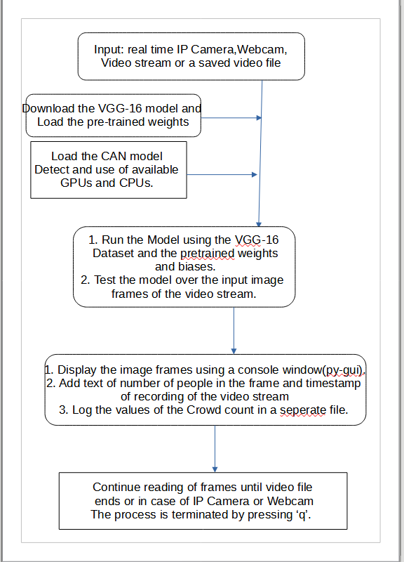
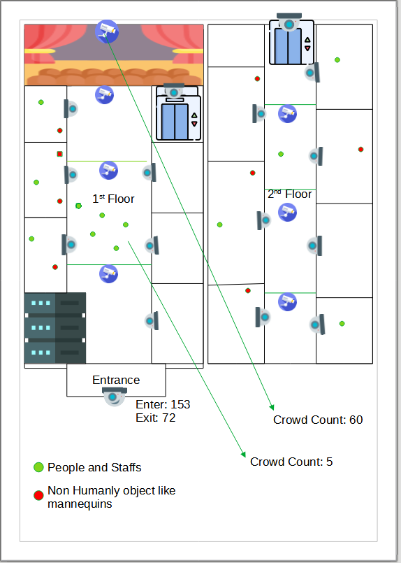

# Mall-Crowd-Counting-Challenge
   

  

## Challenge Details

***Problem Statement***  

The use case is as such : That you are given a task to count the number of people in a shopping mall

***Problem Dimensions***

This problem has following dimensions

Use triangulation or any other algorithm to count number of people in a shopping mall.
State the margin of error or confidence interval of the output.
Since the count of people is a function of time, solution should be such that it takes continuous video feed and give count of people.
IE.g.In a shopping mall with 5 adjacent shops, can the solution give count of people in each shop and aggregate it at the mall level in a live scenario where there is a continuous camera feed in each shop and the corridor.
State assumptions used.

***Team Name- CCC5_SOA***

## Project Details:

## Project Implementation:

**1. People Counting System for Shopping Malls:** [https://github.com/Zeo-shark/People-Counting-System-for-Shopping-Malls](https://github.com/Zeo-shark/People-Counting-System-for-Shopping-Malls).   
 
 - ***Data-Flow Diagram :***
   
  

- ***Output fpr People Counter System:*** 

output_video_crowd.mp4 file  

  
 
  Log files for output_video_crowd.mp4 : 

 

**2. People Couter in Crowded Mall:** [https://github.com/Zeo-shark/People-Counter-in-Crowded-Mall](https://github.com/Zeo-shark/People-Counter-in-Crowded-Mall).  

- ***Data-Flow Diagram :***

   

 - ***Output for People Couter in Crowded Mall:***  

  output_1.png

  
 
 ## Use-Cases  
 
 Primarily we are focusing on the use of this Crowd Counting System in Shopping Malls. as shown below :

 